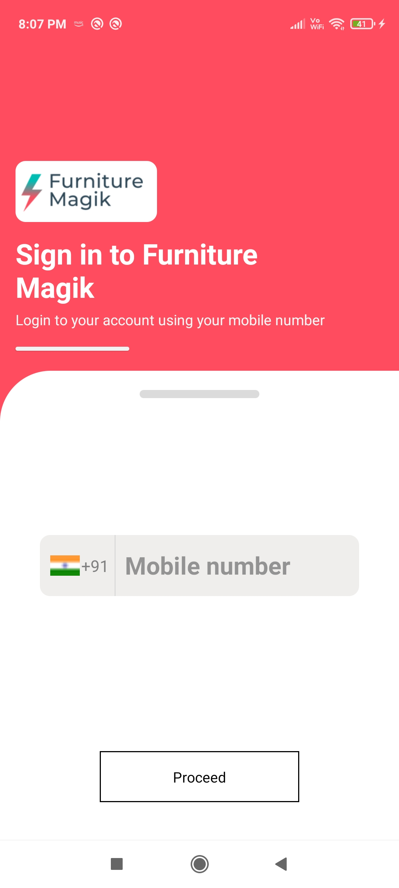
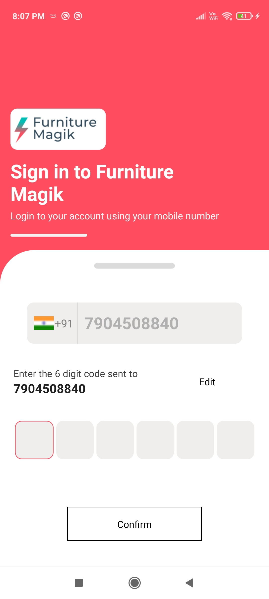
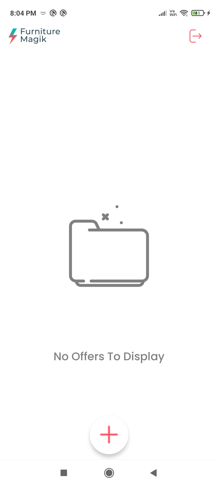
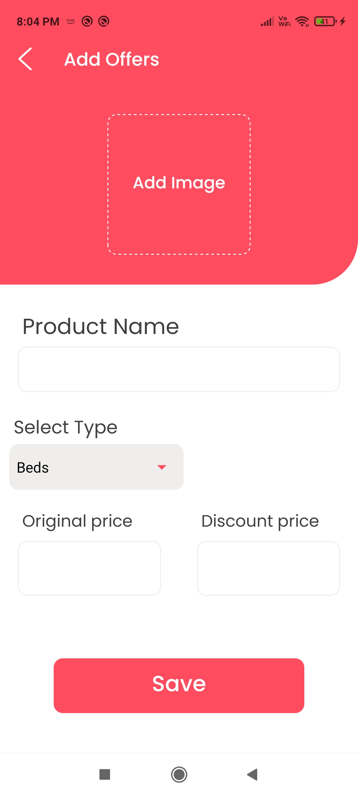
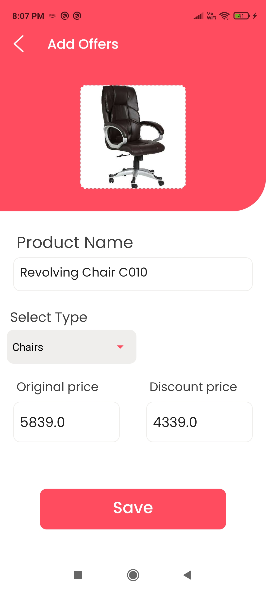
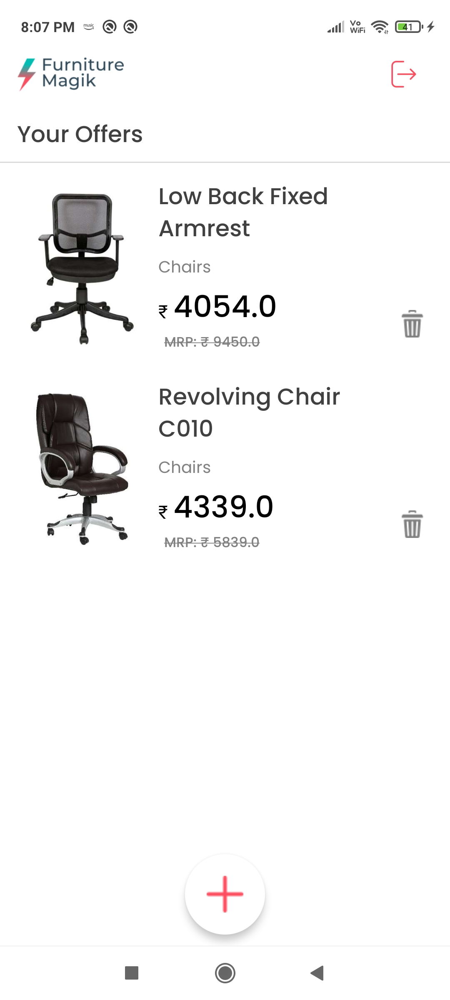

 
 
 

    

 
 
 
A Native Android Application buid with React Native and Authentication (Phone) using Firebase Authentication.
 
 

    <a href="https://drive.google.com/file/d/1PQSH-7WL3xL-F83U5lcwgrNt44Q89gGT/view?usp=sharing" target="_blank">
          Click to Download APK
    </a>

 
 

# Screens

<table><tr>
    <td style="text-align: center">
        
    </td>
    <td style="">
       <h1>Login Screen :</h1>
       
The designed app fo the given requirement consit of login page as its first page. 
       the input is only mobile number and we can proceed only when the number is valid. 
       

    </td>
</tr>
<tr>
    <td style="text-align: center">
        
    </td>
    <td style="">
       <h1>OTP Validation :</h1>
       

       After the validation of the mobile number it is verified with a help of firebase autthentication (Phone Auth) 
       6 digit OTP is received to the corresponding mobile number. Once the entered otp matches with the generated. 
       We can proceed to the next page. 

    </td>
</tr>

<tr>
    <td style="text-align: center">
        
    </td>
    <td style="">
       <h1>Home Screen :</h1>
       

       Login page leads us right here to the home page: 
       the uid generated for every mobile number durng the time  
       of login is the storeKey where all the offers (data) get stored.
      
 
      <h3>Database: (AsyncStorage)</h3> 
The database (Storage unit) used here is AsyncStorage.  
Depending on what the android device has in it, the asyncstorage uses either <b>SQLITE or ROCKSDB</b>. 
Now with the <b>storekey</b> if there is no data stored then the page that says no offers (data) to displays. 
 If the storekey has offers (data) in it then all the offers are displayed in the Flatslit. 

 this page also contains a <b>floating action bar (FAB)</b> denoting 'plus',  
 further navigating to a page where you add data on clicking it. 
    </td>
</tr>

<tr>
    <td style="text-align: center">
        
    </td>
    <td style="">
       <h1>Add Offers (Data Entry) :</h1>
       

       Being navigated to this page we can add new offer (data) with several attributes. 
      This page has several fields describing the product having  
       <b>Product Image  Product Name  Type  Original Price  Discount Price</b> 
       

    </td>
</tr>

<tr>
    <td style="text-align: center">
        
    </td>
    <td style="">
       <h1>Data Validation :</h1>
       

       The  image can be choosen from the gallery or captured instantly to upload. 
 A proper name for the product is given in the product name field. 
 
 
 The next field is the dropdown / dialog where it lets you to choose the type,the product falls in. 
 the next two are numerical input field where original and discount price is fed respectively. 
   
 If we are done with the details of the product, save button is clicked.   
 On clicking empty fields are checked if any found it add a required flag to the particular field.  
       

    </td>
</tr>

<tr>
    <td style="text-align: center">
        
    </td>
    <td style="">
       <h1>Updated List of Added Offers</h1>
       

       Once all the fields are filled, leaving none empty the data is stored using storeKey.  
       After the data is successfully stored, it automatically navigates to the homepage.   
       

    </td>
</tr>

</table>

